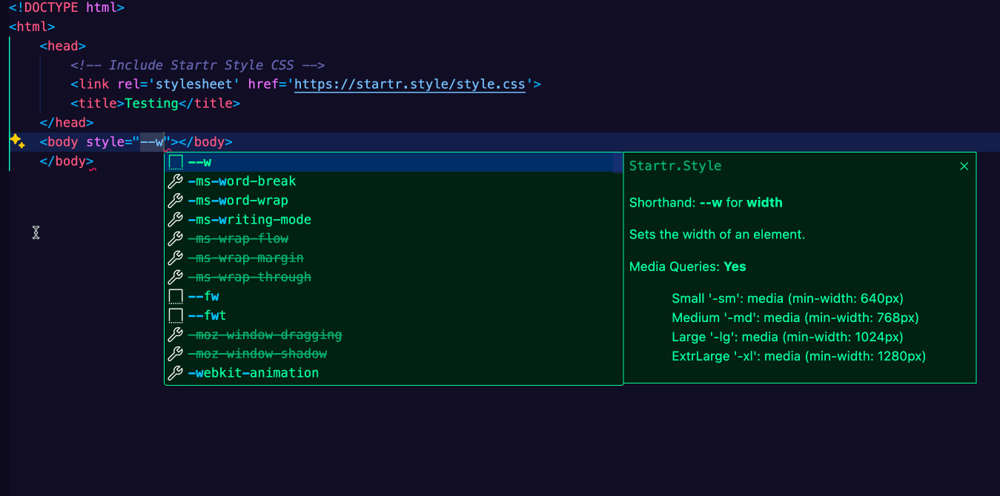
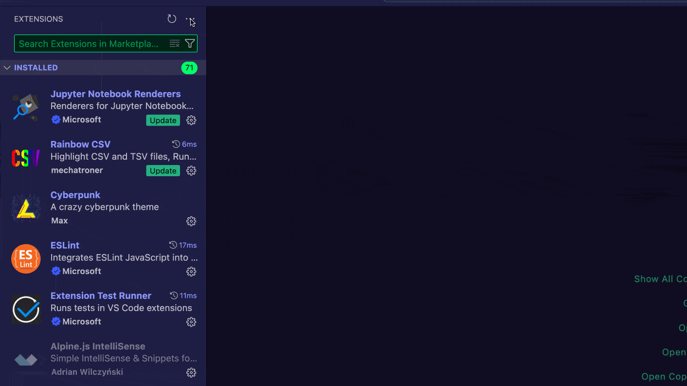

# Startr.Style IntelliSense Extension

> **Get started with Startr’s amazing component utilities directly from VS Code!**  
> This extension provides fast autocompletion suggestions for Startr.Style – a utility complete CSS framework that’s under 50 KB (8 KB zipped). Streamline your workflow by quickly accessing Startr’s custom properties and helpers within your `.html`, `.css`, or related files ASAP!!!

## Features

- **Smart IntelliSense**  
  Enjoy context-aware suggestions for Startr custom properties (like `--bg`, `--p`, `--br`, `--shadow`, etc.) directly in your style attributes or CSS files.
  
- **Utility Complete CSS**  
  Quickly discover and apply Startr's utility-first approach, which leverages custom properties so you can define values without leaving your HTML.

- **Lightweight & Efficient**  
  Startr.Style weighs only ~8 KB when compressed, ensuring your projects remain fast and responsive.

- **Built-In Reference Docs**  
  Hover tooltips and suggestions include short documentation to help you remember property usage, making it easier than ever to code with Startr.Style.

Here's a quick demo of how Startr.Style utilities might look in VS Code:



With this extension you have quick access to Startr.Style in VS Code, providing autocomplete suggestions for `--shadow`, `--p`, `--br`, and more while you type.

## Why Build with Startr.Style

Startr.Style accelerates and standardizes web design through custom property helpers and utilities, all seamlessly integrated within the style attribute. This innovative approach:

- Makes styling faster and more consistent across projects.  
- Enables a lean and efficient workflow with no extra build steps.  
- Provides out-of-the-box styles for core HTML elements (no extra classes needed).  
- Offers the convenience and power of a utility-first framework without the bloat.

**Key Advantages**:

1. **Complete Set of Tools** for styling with CSS.  
2. **Ready-to-Use** – no compilation required.  
3. **Small File Size** (~8 KB compressed).  
4. **Easy to Use** – add a single stylesheet link, and you’re good to go.

## Installation & Usage

1. **Install the Extension**  
   - Open the Extensions view (`Ctrl+Shift+X` or `Cmd+Shift+X`).
   - Search for **“Startr.Style IntelliSense”**.
   - Click **Install**.

2. **Include Startr.Style in Your Project**  
   Add the following line in the `<head>` of your HTML to bring Startr’s default styles into your project:

   ```html
   <link rel="stylesheet" href="https://startr.style/style.css">
   ```

3. **Start Coding**  
   - Begin writing your HTML and CSS.
   - When typing style attributes or CSS properties like `--bg`, `--p`, `--br`, etc., VS Code will automatically provide IntelliSense suggestions from this extension.

### Example

```html
<html>
  <head>
    <link rel="stylesheet" href="https://startr.style/style.css">
  </head>
  <body>
    <button style="--d:block; --d-md:none;">
      Only visible on small screens
    </button>
  </body>
</html>
```

Here, Startr.Style’s responsive utility `--d-md:none` is applied, making the button hidden on medium+ screens.

## Requirements

- VS Code version 1.60.0 or higher is recommended.  
- A basic HTML/CSS project structure (the extension primarily focuses on `.html` and `.css` files, but may also assist in React/JSX if style attributes are used).

## Extension Settings

At this time, the extension provides IntelliSense out of the box without additional configuration. Future settings might include:

- `startrStyle.enable`: Enable/disable the extension.  
- `startrStyle.suggestionsPriority`: Adjust the priority of Startr.Style suggestions relative to other suggestions.

## Known Issues

- Some custom properties may not appear in certain templating or framework-based files if VS Code does not recognize them as HTML/CSS.  
- For best results, make sure the files are set to HTML/CSS syntax.  

If you experience any issues, please [open an issue on GitHub](https://github.com/Startr/VSCODE-Startr.Style/issues).

## Release Notes

### 1.0.0
- Initial release of Startr.Style IntelliSense extension.
- Provides IntelliSense suggestions for Startr’s custom property utilities.
- Includes basic hover documentation and autocomplete.

### 1.1 (Upcoming)
- Added improved IntelliSense coverage for responsive variants 
  > (e.g., `--property-sm`, `--property-md`, etc.).
- Enhanced documentation for built-in Startr variables.
- Improved suggestion matching for inline styles in HTML and MarkDown.
- Minor bug fixes.

---

## More About Startr.Style

- **Responsive Design**  
  Seamlessly switch or apply utilities (`--d-sm`, `--d-md`, etc.) for different screen sizes.

- **No Classes Needed**  
  Style your HTML elements with minimal markup; simply embed custom properties in the `style` attribute.

- **Flexible & Customizable**  
  You define the values. Whether it’s a named CSS variable (`--bg:var(--dark)`) or a hex code (`--bg:#2A2A2A`), Startr.Style accommodates any valid CSS input.

- **Experiment & Prototype**  
  Perfect for quickly mocking up UI ideas right inside HTML. No huge CSS buildup as your project grows.

For a deeper dive, please visit [Startr.Style](https://startr.style/) or explore our GitHub repository for additional docs and resources.

---

**Enjoy building with Startr.Style and make styling a breeze!**  


## Manual Install

1. Download the latest release of [our VSIX from the github repo](./startr-style-auto-completion-0.0.1.vsix) or clone the repo and build the extension yourself.
2. Open VS Code and click on the Extensions icon in the Activity Bar on the side of the window.
3. Click on the More Actions icon (3 horizontal dots) in the Extensions view and select Install from VSIX....
4. Select the `.vsix` file you downloaded in step 1.
5. Click Install to start the installation.

